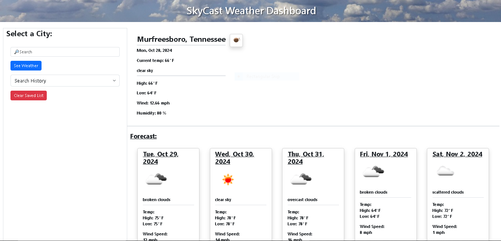
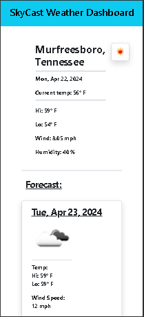

# SkyCast Weather ⛅

## Description  
SkyCast Weather is a responsive weather application that allows users to view the current weather conditions of any city along with a 5-day forecast. The app ensures a seamless experience on both desktop and mobile devices.

## Tech Stack  
- **Frontend**: HTML, CSS, JavaScript, jQuery  
- **UI Framework**: Bootstrap  
- **API**: OpenWeather RESTful API  
- **Deployment**: GitHub Pages  
- **Storage**: Local Storage for saving search history across sessions  

## Access  
You can try the live application here: [SkyCast Weather](https://jfleming963.github.io/SkyCast-Weather-App/).

## Usage  
1. **Search for a City**:  
   Enter a city name in the search input field and click the **See Weather** button to display current conditions and a 5-day forecast.  

2. **Saved Searches**:  
   Searches are stored locally and can be accessed from the **Saved Searches** dropdown menu.  

3. **Clear Search History**:  
   Use the **Clear Saved List** button to remove all saved searches from local storage.

## Screenshots  
### Desktop View  
  

### Mobile View  

## Credits  
- **API Provider**: OpenWeather  
- **Icons**: Bootstrap Icons

## License  
This project is licensed under the terms outlined in the LICENSE file.