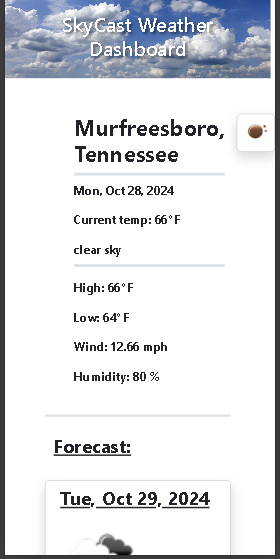

# SkyCast Weather ⛅

## Description
This handy weather app allows the user to see the current weather conditions of a city as well as the 5-day forcast.
## Installation

Use this link to visit [SkyCast Weather](https://flem-house-dev.github.io/SkyCast-Weather-App/).

## Usage
Type a city name into the Search input, and select the `See Weather` button. 
Searches are saved locally, and they can be recalled by selecting from the `Saved Searches` dropdown-select menu. User also has the option of clearing search history by selecting the `Clear Saved List` button.
## Credits
n/a
## License 

Please refer to the LICENSE in the repo.

### Desktop:

### Mobile:

